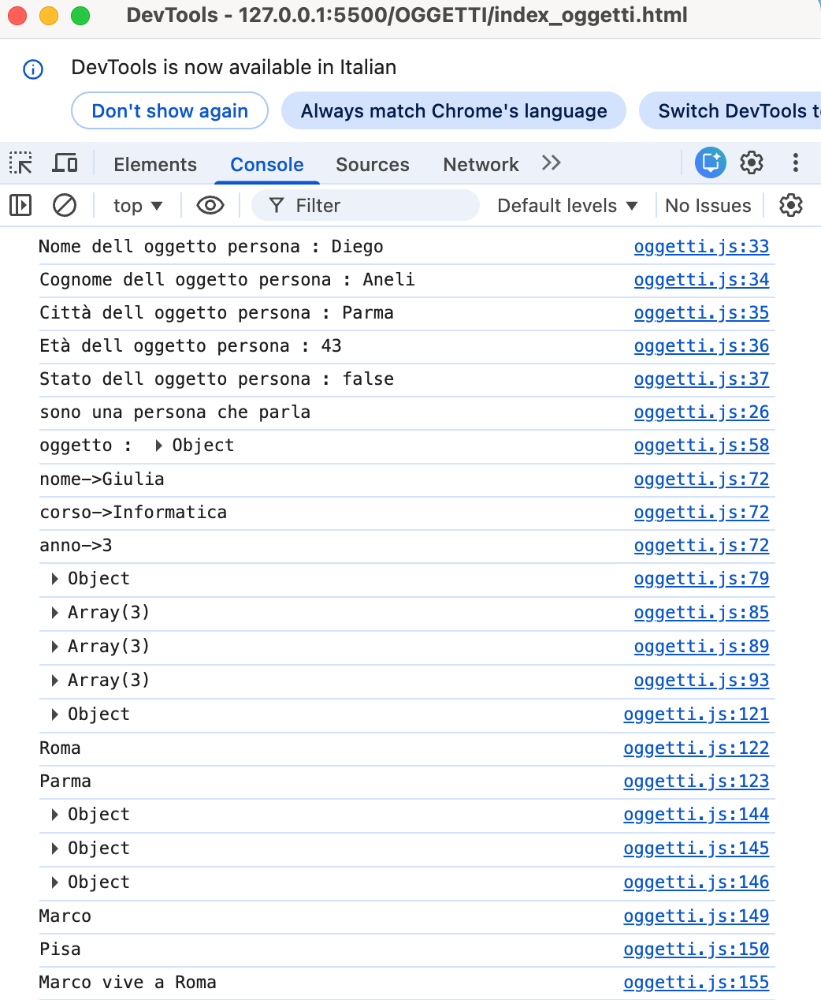
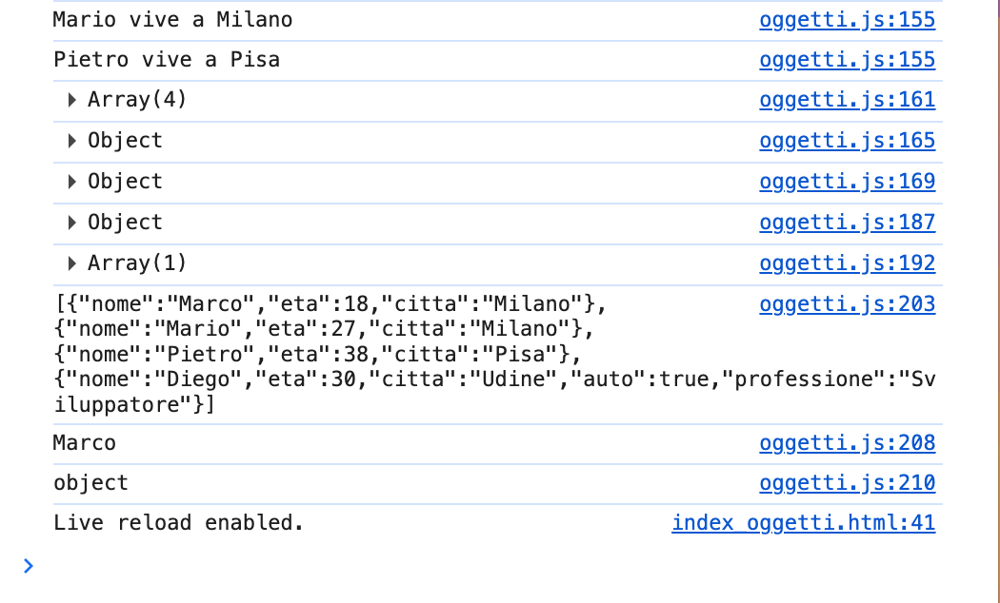
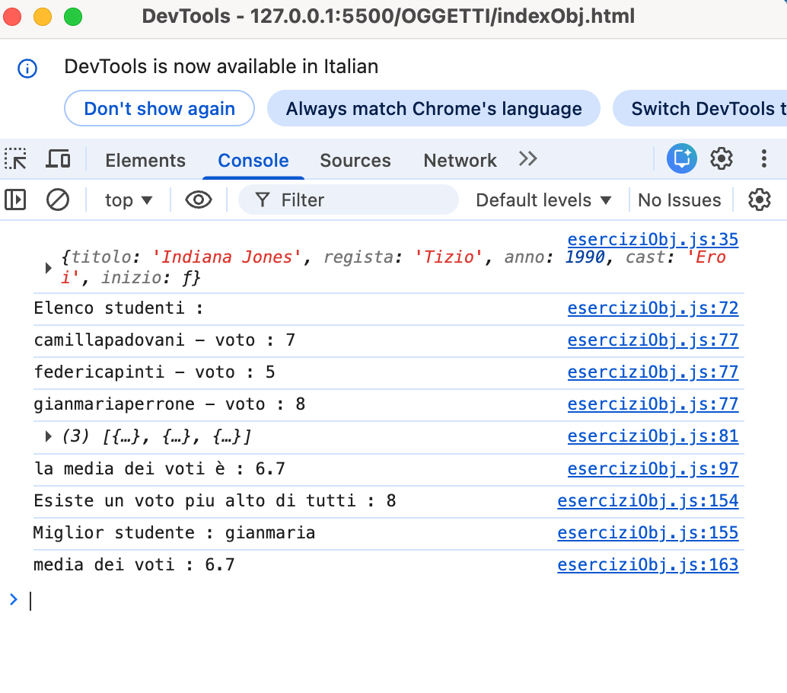

# Esercizi con oggetti
*Novembre 2025* 👩🏻‍💻

---
***Screenshot1 della console di oggetti***




***Screenshot2 della console di oggetti***



***Screenshot della console di eserciziObj***


---

⚒️

| Nome | Linguaggio | Versione |
|------|------------|----------|
| HTML |Markup      | 5        |
| Java |Logic       | ES7      |

---

👩🏻‍💻

```
Avviare Golive su VSCode
